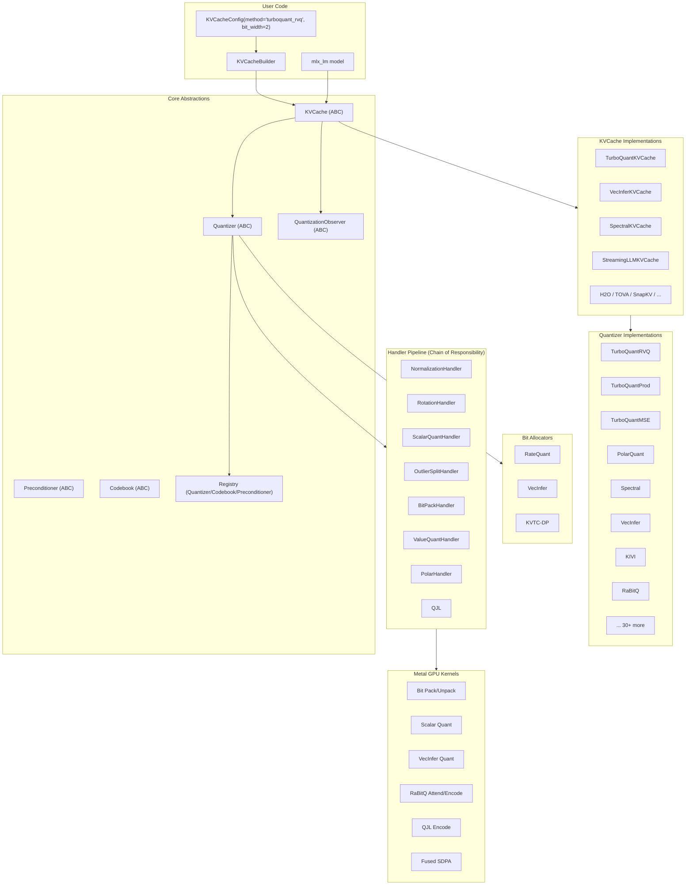
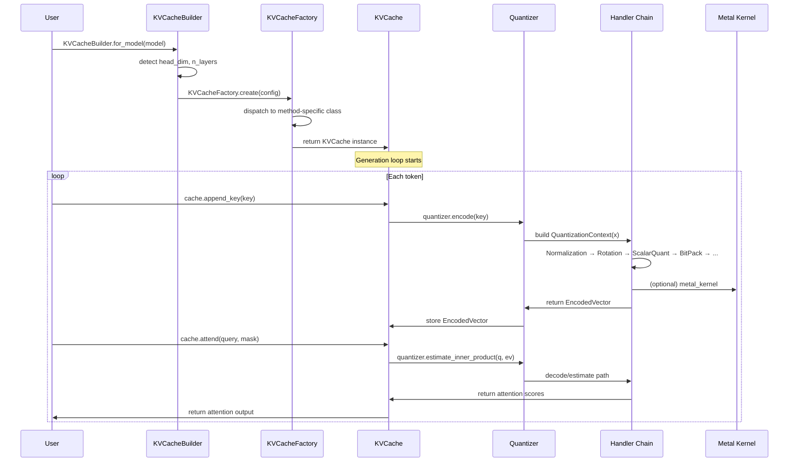

# VeloxQuant-MLX Learning Plan & Architecture

## Quick Navigation

| Section | Description |
|---|---|
| [Architecture Overview](#architecture-overview) | High-level system diagram |
| [Data Flow](#data-flow) | How a KV-cache operation flows through the system |
| [Package Layout](#package-layout) | Source tree map |
| [Learning Roadmap](#learning-roadmap) | Step-by-step plan to master the codebase |
| [Resources](#resources) | Built-in docs, blogs, papers |

---

## Architecture Overview



---

## Data Flow



---

## Package Layout

```
veloxquant_mlx/
├── __init__.py          # Public API exports
├── __main__.py          # CLI: precompute, benchmark, recommend
├── core/                # ABCs, dataclasses, registry, constants
├── cache/               # 46 KVCache wrappers (one per method)
├── quantizers/          # 46 quantizer implementations
├── handlers/            # Chain-of-responsibility pipeline stages
├── metal/               # Apple Metal MSL GPU kernels
├── allocators/          # Bit allocation strategies (RateQuant, etc.)
├── integration/         # mlx_lm / mlx_vlm monkey-patching
├── preconditioners/     # Rotation / JL sketch transforms
├── codebooks/           # Scalar codebook strategies
├── observers/           # Timing, memory, distortion observers
├── transforms/          # Polar transform
├── spectral/            # SpectralQuant components
├── outlier/             # Outlier detection
├── dsa/                 # Data structures (AVL, heap, ring buffer)
├── math/                # MLX-free math utilities
├── weight/              # Weight quantization (experimental)
├── tools/               # Mac recommender
└── tests/               # 100+ test files (1417 tests)
```

---

## Learning Roadmap

### Phase 1: Foundation (Start Here)

| Step | File(s) | What to Learn |
|------|---------|---------------|
| 1.1 | `README.md` | Project goals, supported methods, 3-line API |
| 1.2 | `pyproject.toml` | Dependencies, CLI entry points, build system |
| 1.3 | `veloxquant_mlx/__init__.py` | Public API surface |
| 1.4 | `veloxquant_mlx/core/abstractions.py` | The 8 ABCs everything plugs into |
| 1.5 | `veloxquant_mlx/core/context.py` | Key data types: QuantizationContext, EncodedVector |
| 1.6 | `veloxquant_mlx/core/registry.py` | How methods register themselves |

### Phase 2: Configuration & Wiring

| Step | File(s) | What to Learn |
|------|---------|---------------|
| 2.1 | `veloxquant_mlx/cache/base.py` | KVCacheConfig, KVCacheFactory, KVCacheBuilder |
| 2.2 | `veloxquant_mlx/integration/mlx_lm_patch.py` | How it monkey-patches mlx_lm |
| 2.3 | `veloxquant_mlx/quantizers/base.py` | QuantizerFactory — how method names resolve to classes |

### Phase 3: Reference Method — TurboQuant RVQ

| Step | File(s) | What to Learn |
|------|---------|---------------|
| 3.1 | `veloxquant_mlx/quantizers/turboquant_rvq.py` | RVQ encode/decode/estimate_inner_product |
| 3.2 | `veloxquant_mlx/cache/turboquant_rvq_cache.py` | Cache wrapper: append_key, attend |
| 3.3 | `veloxquant_mlx/handlers/` | Walk the handler pipeline chain |

### Phase 4: Other Method Families

| Step | File(s) | What to Learn |
|------|---------|---------------|
| 4.1 | `veloxquant_mlx/quantizers/vecinfer.py` + `cache/vecinfer_cache.py` | Sub-2-bit product-quantization method |
| 4.2 | `veloxquant_mlx/quantizers/polarquant.py` | Polar coordinate transform + scalar quant |
| 4.3 | `veloxquant_mlx/quantizers/qjl.py` | Johnson-Lindenstrauss sketch + sign quant |
| 4.4 | `veloxquant_mlx/quantizers/spectral.py` + `spectral/` | Spectral decomposition + adaptive bit allocation |
| 4.5 | `veloxquant_mlx/quantizers/kivi.py` + `cache/kivi_cache.py` | Asymmetric group quantization |
| 4.6 | Cache files in `cache/` for: `snapkv`, `streaming_llm`, `h2o`, `tova` | Token eviction methods |
| 4.7 | `minicache_cache.py`, `xkv_cache.py`, `xquant_cache.py` | Cross-layer / low-rank sharing |

### Phase 5: Metal GPU Kernels

| Step | File(s) | What to Learn |
|------|---------|---------------|
| 5.1 | `veloxquant_mlx/metal/kernels.py` | Kernel re-export facade |
| 5.2 | `veloxquant_mlx/metal/_vecinfer.py` | VecInfer GPU quantize/dequant |
| 5.3 | `veloxquant_mlx/metal/_rabitq_attend.py` | Fused RaBitQ attention (1.78x speedup) |
| 5.4 | `veloxquant_mlx/metal/_bit_packing.py` | Bit pack/unpack on GPU |
| 5.5 | `veloxquant_mlx/metal/fused_sdpa.py` | Fused dequant + SDPA |

### Phase 6: Advanced Topics

| Step | File(s) | What to Learn |
|------|---------|---------------|
| 6.1 | `veloxquant_mlx/allocators/ratequant.py` | Per-layer mixed-precision bit allocation |
| 6.2 | `veloxquant_mlx/observers/` | Pipeline observers (timing, memory, distortion) |
| 6.3 | `veloxquant_mlx/preconditioners/` | Rotation and JL sketch transforms |
| 6.4 | `veloxquant_mlx/codebooks/` | Codebook strategies (scalar, adaptive) |
| 6.5 | `veloxquant_mlx/dsa/` | Custom data structures (AVL tree, heap, ring buffer) |
| 6.6 | `veloxquant_mlx/tools/mac_recommender.py` | Method recommendation engine |

### Phase 7: Testing & Benchmarks

| Step | What to Learn |
|------|---------------|
| 7.1 | Run tests: `python -m pytest veloxquant_mlx/tests/ -v` |
| 7.2 | Study `veloxquant_mlx/tests/conftest.py` — shared fixtures |
| 7.3 | Read `tests/conftest.py` + any test for a quantizer |
| 7.4 | Browse `benchmark_scripts/` — how methods are benchmarked |
| 7.5 | Run CLI: `python -m veloxquant_mlx recommend` |

### Phase 8: Documentation & Research

| Step | What to Learn |
|------|---------------|
| 8.1 | Read `CITATIONS.md` — full bibliography of 41 methods |
| 8.2 | Browse `paper/research/surveys/` — method surveys |
| 8.3 | Read `blogs/overview.md` + `blogs/metal-kernels.md` |
| 8.4 | Browse `docs/` — internal design docs |
| 8.5 | Explore `docs-site/` — Docusaurus documentation website |

---

## Resources

| Resource | Location |
|---|---|
| README | `README.md` |
| Blog posts | `blogs/` (9 posts) |
| Internal docs | `docs/` (7 documents) |
| Research surveys | `paper/research/surveys/` (21 versions) |
| Changelog | `CHANGELOG.md` |
| Bibliography | `CITATIONS.md` |
| Docusaurus site | `docs-site/` (TypeScript, deployable) |
| Metal benchmarks | `scripts/metal_rabitq_attend_bench.py` |
| Knowledge base | `turbo_quant_kb/` |
| CI config | `.github/workflows/` |
| Optimization findings | `OPTIMIZATION_FINDINGS.md` |

---

## Quick Start

```python
from veloxquant_mlx import KVCacheBuilder, KVCacheConfig

config = KVCacheConfig(method="turboquant_rvq", bit_width_inlier=2)
cache = KVCacheBuilder(config).build()

# Or attach to an mlx_lm model:
caches = KVCacheBuilder(config).for_model(model)

# During generation:
cache.append_key(key)
cache.append_value(value)
output = cache.attend(query, attention_mask)
```
